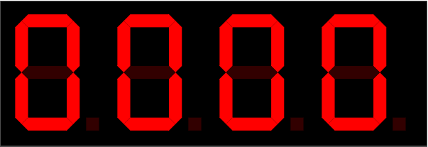
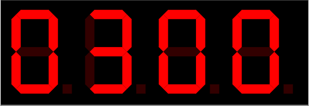

# FPGA UART interface
## About the project
Realization of the UART transceiver. This module controls four 7-segment indicators on a FPGA evaluation board.
This project was done during my study of FPGA programming. Realization is simple and can be useful only for educational purposes. To add some interactivity, a four-digit 7-segment indicator was added to be controlled via UART. Each of the four digits could be updated independently.

## Features
* 9600 baud speed

## How to use
The project requires an FPGA with two available pins for the UART interface. Four-digit 7-segment display should also be connected to the FPGA pins.
Initially, all the digits on the display are set to 0.

To set the required digit on the display via UART transmission, two bytes need to be sent. The first byte should contain information about the digit number on the display. The second byte should contain the digit to display. For example, sending '23' will result in the next display output:

At the same time, the UART module will answer 'Ok'. In case the transmission contains the wrong data UART module will answer 'Er' which means an error in received data.
